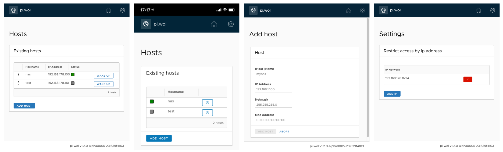

# pi-wol

[](https://ci.appveyor.com/project/chtake/pi-wol/branch/master) [](https://ci.appveyor.com/project/chtake/pi-wol/branch/develop)

Pi-wol is an webbased wake on lan service running on any system which is supported by the dotnet runtime (e.g. linux, mac osx and windows). Initial it is developed to run on an raspberry-pi but it also runs on other platforms.



## Run the application
### Docker
You can use either the docker-compose.yml or start the container direct. Important is to run the container with network_mode "host" to get the wake on lan magic packets work properly.
Change the volumes to your needs.

    volumes:
      - /srv/docker/pi-wol/data:/app/data

#### docker compose
```
docker-compose up -d
```
#### docker run
```
docker run --network="host" \
            -v /srv/docker/pi-wol/data:/app/data \
            -e "ASPNETCORE_URLS=http://+:8080" \
            chtake/pi-wol:latest
```

### Use pi-wol
Add your wake on lan capable computers to the app and wake it up through the webpage. The piwol must be on the same network as your wol clients. So you can also wake up computers indirect from vpn, internet or other subnets as your clients are with piwol.

**Restrict access**
You can restrict the access of the pi-wol by ip address or whole networks. Multiple combinations of single hosts and networks are possible.

It`s also highly recommended to deny access from the internet with your router/firewall and access the app only within your local (w)lan and via vpn.

**Mobile usage**
You can add the webapp to your homescreen.

### Binary releases
Download the binary from the release tab and start it with `dotnet run PiWol.WebApp.dll`. The dotnet runtime 2.2 is required.

### Build from source
Build the source with dotnet cli.

    dotnet restore
    dotnet publish ./src/PiWol.WebApp/PiWol.WebApp.csproj -c release -r [Runtime] -o [Your Output Folder]

## Contribution

Any contributions are welcome. If you find bugs or have some feature wishes, please feel free to submit an ticket on the issue tab. However, also development contributions are highly welcome.

The git branching structure follows the gitflow branching strategy. This means, the *master* branch is for releases only, the *develop* is the active development branch, where your *feature* branchs will be merged into.

The application architecture follows loosly the onion architecture with some naming convention used by the dotnet assemblies (e.g. the *Abstraction* namespaces).

Also some unit tests of your newly developed feature would be great. 100% is not necessary, but some basic unit tests of the core functionality or some tricky things whould be fantastic.

## Licence
see [LICENSE](LICENSE)